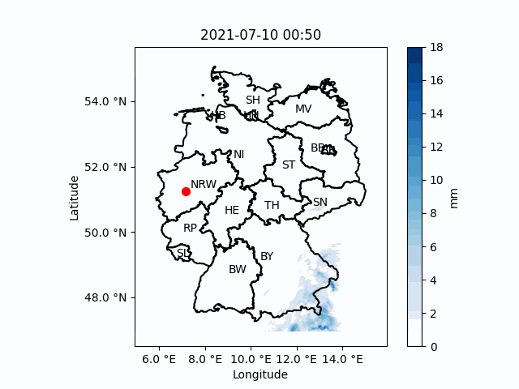

# Data Analysis to Protect Against Climate-Driven Extremes

>Elias Theis, University of Wuppertal 
>Institute of Technologies and Management of the Digital Transformation 
>Sumbitted for the seminar "Selected Topics in Data-Science" 2025

## Preparing the Dataset
In order to reproduce any analysis, the dataset has to be prepared by decompressing and homogenizing the resolution. This can be done by executing `prepare_dataset.py`. You just have to change the paths and the bottom of the file before. The data set is thereby inflated from around `10GB` to around `400GB`.

## Settings the path
After the data set has been prepared, all data accesses are carried out via a central method (`util.read_radar_data`). The correct path to the unpacked data can be set at the top of the `util.py` file. This variable is called `PATH_TO_UNCOMPRESSED_DATA` and has to be a `Path`-object (from `pathlib`).

## Recreating the basic figures
First, uncomment the `create_basic_figures()` call at the bottom of the `main.py` and then run it. This could take a relatively long time.

## Creating a GIF animation of raw data
First, uncomment the `create_gif()` call at the bottom of the `main.py` and then run it.

## Create a CPD animation
First, uncomment the `create_daily_precipitation_file()`, set a range of dates and call at the bottom of the `main.py`. Afterwards, set the correct starting date and run the `cumulative_precipitation_with_decay.py` file. This could take a relatively long time. Note: dont interact with the pyplot window.

## Hardware Requirements
- At least 32GB of RAM
- About 400GB of free disk space
- A CUDA capable GPU

